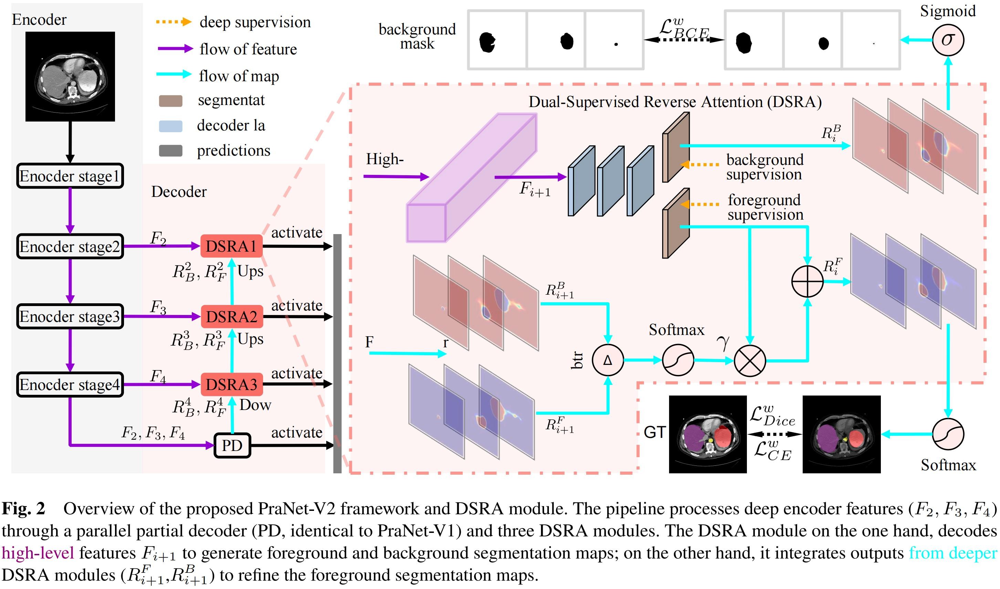
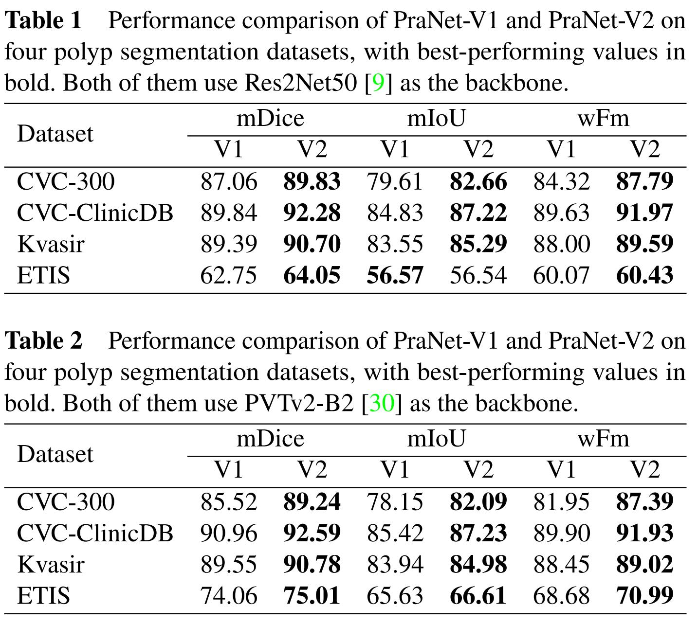
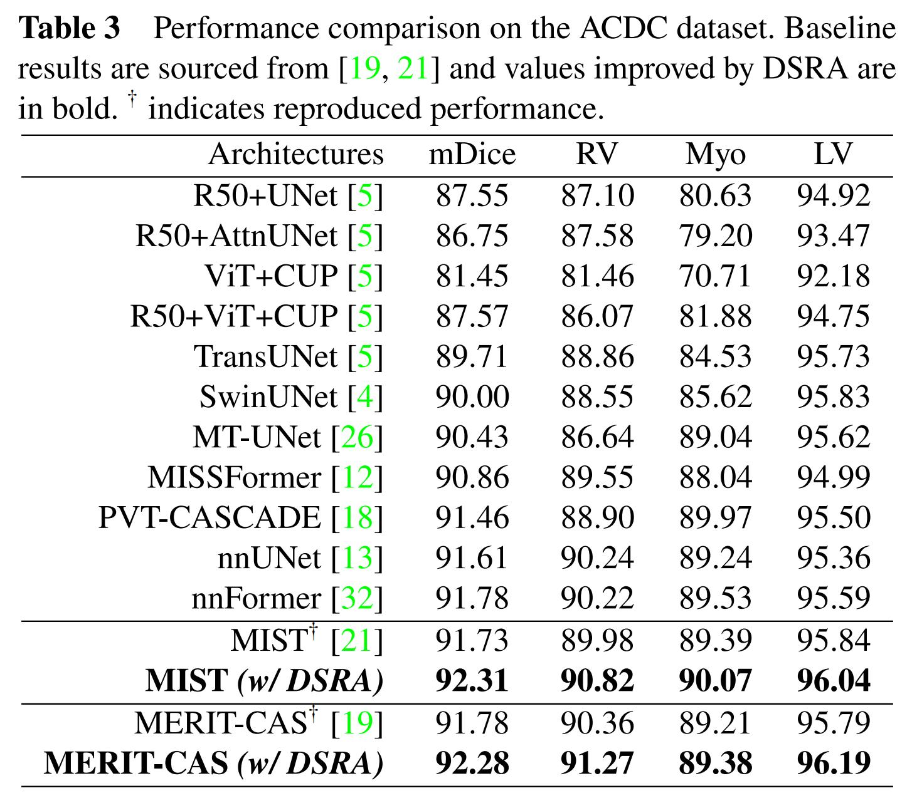
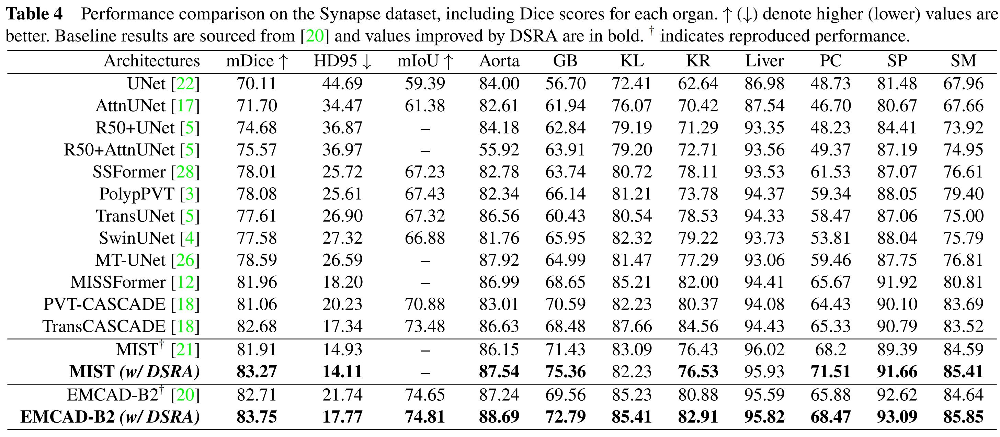
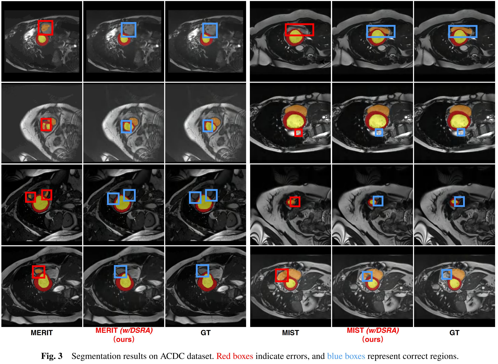
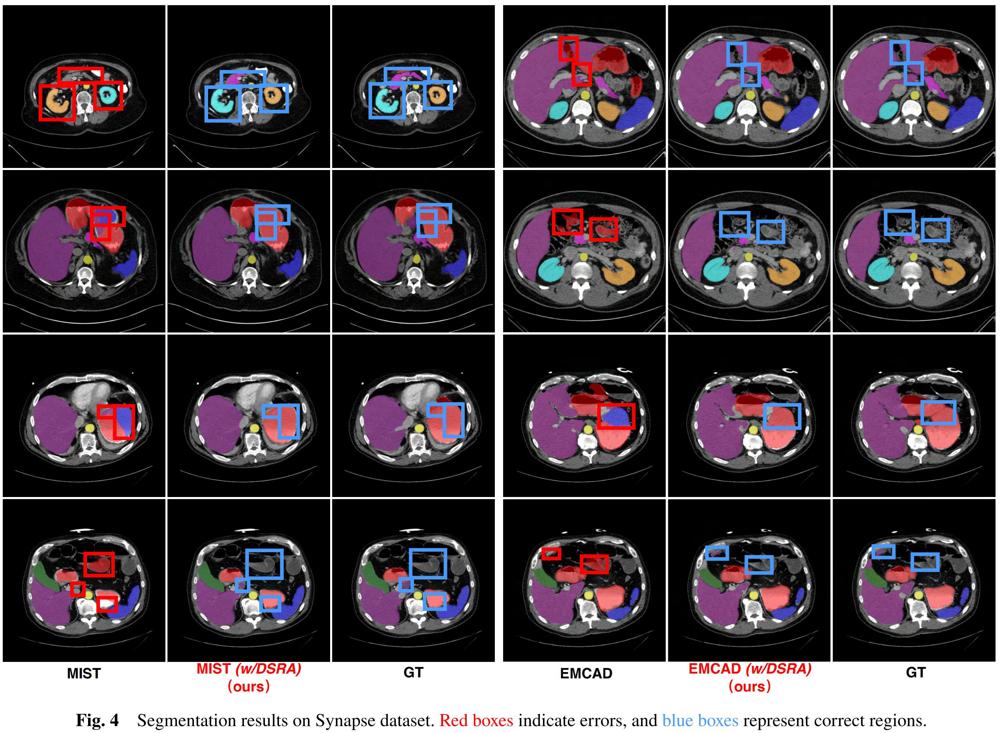

<h1 align="center">PraNet-V2: Dual-Supervised Reverse Attention for Medical Image Segmentation</h1>

<div align='center'>
    <strong>Bo-Cheng Hu</strong></a><sup>1</sup>,&thinsp;
    <a href='https://scholar.google.com/citations?user=oaxKYKUAAAAJ' target='_blank'><strong>Ge-Peng Ji</strong></a><sup> 2</sup>,&thinsp;
    <a href='https://scholar.google.com/citations?user=amxDSLoAAAAJ' target='_blank'><strong>Dian Shao</strong></a><sup> 3</sup>,&thinsp;
    <a href='https://scholar.google.com/citations?user=kakwJ5QAAAAJ' target='_blank'><strong>Deng-Ping Fan</strong></a><sup> 1</sup>,&thinsp;
</div>

<div align='center'>
    <sup>1 </sup>Nankai University&ensp;  <sup>2 </sup>Australian National University&ensp;  <sup>3 </sup>Northwestern Polytechnical University&ensp; 
</div>


# 🔥News🔥

**`Jan 1, 2025:`**Release training/testing code.

**`Dec 31, 2024:`**Upload pre-trained weights.

**`Dec 18, 2024:`**Create repository.

# Overview

### Abstract

Accurate medical image segmentation is essential for effective diagnosis and treatment. PraNet-V1 enhanced polyp segmentation by introducing a parallel reverse attention (RA) module that leverages background information. However, it is limited in handling complex multi-organ segmentation within medical imaging datasets. To extend the applicability of RA to a broader range of medical imaging tasks, we propose a Dual-Supervised Reverse Attention (DSRA) module, which incorporates explicit background supervision, independent background modeling structure and semantically enriched attention fusion. Based on DSRA, we develop the PraNet-V2 framework, which shows strong performance across diverse polyp segmentation datasets. Additionally, leveraging DSRA as a plug-and-play module, we integrate DSRA into three state-of-the-art models for medical image semantic segmentation and achieved a maximum improvement of 1.36% in the Dice score compared to their original performances.


### Framework Overview



### Qualitative Results







### Quantitative Results






# Usage

### Environment Setup

```bash
git clone git@github.com:ai4colonoscopy/PraNet-V2.git
cd PraNet-V2
# We use Python3.9, CUDA 12.2, PyTorch2.0.1.
conda env create -f pranet2.yaml
conda activate pranet2
cd PraNet-V2
```

### Dataset Preparation

1. **Polyp datasets**
   - To download the training and testing datasets, use this [Google Drive Link](https://drive.google.com/drive/folders/1Hi-ztnzRtWvdGejYHTyOAn6fNBWcWLik?usp=drive_link) and place it in the directory `./binary/data`.
2. **ACDC and Synapse datasets**
   - Please refer to the [EMCAD](https://github.com/SLDGroup/EMCAD) for the preprocessed dataset used in this project. Make sure to follow their guidelines for proper usage. 

### Weights Preparation
**We also need PVTV2B2 and Res2Net weights**,  Please [click here to download](https://drive.google.com/drive/folders/17VuWBy6CnEXF7kASydQGsZgYFjiwhez2?usp=drive_link) them. 🎯


# Interface

📦 Before running the inference script, make sure to grab the [pre-trained model weights](https://drive.google.com/drive/folders/1o4UHzI48wwEtpz-J91dnIRhtYy67lFCO?usp=drive_link) 🔗. 

### PraNet-V2 series

We recommend to organize the PraNet series models under `./binary/snapshots` following the structure below:

```
snapshots
├── PraNet-V1
│   └── RES-V1.pth
├── PraNet-V2
│   └── RES-V2.pth
├── PVT-PraNet-V2
│   └── PVT-V2.pth
└── PVT-V1
    └── PVT-V1.pth
```

Next, don’t forget to fill in the model path and segmentation result save path as guided by the **TODO markers**. Once done, run the following command: 

```bash
cd ./binary
python -W ignore ./MyTest_med.py
```

The polyp segmentation results will be saved in your predefined result save path. 📂

After that, follow the steps in the [Evaluation](#evaluation) section to obtain all the metrics! 📊 

### Multi-class segmentation models

For the multi-class segmentation models, place our trained models in their respective `model_pth` folders. For example:

`./multi-class/EMCAD/model_pth/ACDC/EMCAD_ACDC.pth`

Then, run the corresponding inference scripts to get test results (📝Logs will be saved in `./test_log`) :

```bash
# MIST 
cd ./multi-class/MIST-main
python -W ignore Synapse_test.py 
python -W ignore test_ACDC.py

# EMCAD
cd ./multi-class/EMCAD
python -W ignore test_synapse.py

# 【Visualization】 Use the –is_savefig option to save visualization results, e.g., python -W ignore Synapse_test.py --is_savefig.
```


# Evaluation

### PraNet-V2 series

For the **PraNet series models**, follow the **Interface** steps to generate segmentation results, which will be saved in the results folder. Afterward, run the `eval.py` script to generate a performance evaluation table in the `eval_results` folder.

```
python -W ignore ./binary/eval.py
```

The `eval.py` script provides **four eval_config options** for evaluating the performance of the following models: PraNet-V1、PVT-PraNet-V1、PraNet-V2、PVT-PraNet-V2. You can try different configs in the script to check out the evaluation results for these models.

### Multi-class segmentation models

For the three **multi-class segmentation models**, the evaluation results are already logged during the **Interface** step.


# Training

### PraNet-V2 series


### Multi-class segmentation models


## Acknowledgement:

A huge thanks to the following **excellent works**: [PraNet](https://github.com/DengPingFan/PraNet), [Polyp-PVT](https://github.com/DengPingFan/Polyp-PVT), [UACANet](https://github.com/plemeri/UACANet), [CASCADE](https://github.com/SLDGroup/CASCADE), [MERIT](https://github.com/SLDGroup/MERIT), [MIST](https://github.com/Rahman-Motiur/MIST), and [EMCAD](https://github.com/SLDGroup/EMCAD). 🙌✨


# Bibtex 

