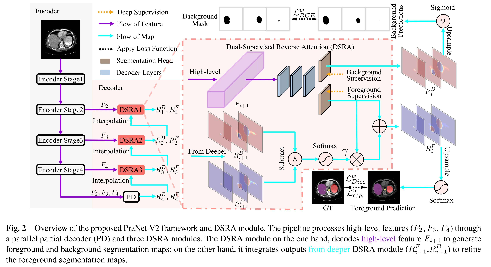
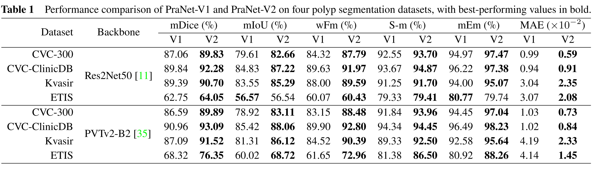
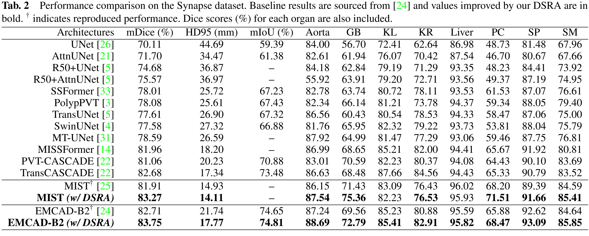

<h1 align="center">PraNet-V2: Dual-Supervised Reverse Attention for Medical Image Segmentation</h1>

<div align='center'>
    <a href='https://scholar.google.com/citations?user=VBb03aoAAAAJ' target='_blank'><strong>Bo-Cheng Hu</strong></a><sup> 1</sup>,&thinsp;
    <a href='https://scholar.google.com/citations?user=oaxKYKUAAAAJ' target='_blank'><strong>Ge-Peng Ji</strong></a><sup> 2</sup>,&thinsp;
    <a href='https://scholar.google.com/citations?user=amxDSLoAAAAJ' target='_blank'><strong>Dian Shao</strong></a><sup> 3</sup>,&thinsp;
    <a href='https://scholar.google.com/citations?user=kakwJ5QAAAAJ' target='_blank'><strong>Deng-Ping Fan</strong></a><sup> 1</sup>&thinsp;
</div>

<div align='center'>
    <sup>1 </sup>Nankai University&ensp;  <sup>2 </sup>Australian National University&ensp;  <sup>3 </sup>Northwestern Polytechnical University&ensp; 
</div>

<div align='center'>
<video src="https://github.com/user-attachments/assets/6f4e91dd-f13b-4597-a896-26031656e5e6" controls width="600" />
</div>

# 🔥News🔥
- **`Apr 15, 2025`:**  🎉 We are excited to introduce the [inference code](https://github.com/ai4colonoscopy/PraNet-V2/blob/main/binary_seg/jittor/MyTest.py) for the PraNet series models (PraNet-V1, PVT-PraNet-V1, PraNet-V2, PVT-PraNet-V2) running on the **Jittor** framework! [Performance evaluation](https://github.com/ai4colonoscopy/PraNet-V2/tree/main/binary_seg/jittor#performance-comparison) and [inference speed tests](https://github.com/ai4colonoscopy/PraNet-V2/tree/main/binary_seg/jittor#speedup) have shown that Jittor significantly boosts inference speed compared to the PyTorch framework. Give it a try and feel the difference! ✨😊

- **`Apr 15, 2025`:** 🚀 Released training/testing code! **PraNet-V2 now supports both**
  
  🔹 [**Binary Segmentation**](binary_seg/README.md) (e.g., polyp segmentation) 🩺
  
  🔹 [**Multi-Class Segmentation**](multiclass_seg/README.md) (e.g., multi-organ/tissue segmentation) 🌈

  Explore the training and testing details in their respective directories **or follow the detailed setup steps below in this README!** 🎉

# Overview

### Abstract

Accurate medical image segmentation is essential for effective diagnosis and treatment. PraNet-V1 enhanced polyp segmentation by introducing a parallel reverse attention (RA) module that leverages background information. However, it is limited in handling complex multi-organ segmentation within medical imaging datasets. To extend the applicability of RA to a broader range of medical imaging tasks, we propose a **Dual-Supervised Reverse Attention (DSRA)** module, which incorporates explicit background supervision, independent background modeling structure and semantically enriched attention fusion. Based on DSRA, we develop the PraNet-V2 framework, which shows strong performance across diverse polyp segmentation datasets. Additionally, leveraging DSRA as a plug-and-play module, we integrate DSRA into three state-of-the-art models for medical image semantic segmentation and achieved a maximum improvement of **1.36%** in the Dice score compared to their original performances.


### Framework Overview



### Quantitative Results

<div align=center>
    
</div>




<div align=center>

</div>


### Qualitative Results


# Usage

### Environment Setup

```bash
git clone git@github.com:ai4colonoscopy/PraNet-V2.git
cd PraNet-V2
# We use Python3.9, CUDA 12.2, PyTorch2.0.1.
conda env create -f pranet2.yaml
conda activate pranet2
cd PraNet-V2
```

### Dataset Preparation

1. **Polyp datasets**
   - To download the training and testing datasets, use this [Google Drive Link](https://drive.google.com/drive/folders/1Hi-ztnzRtWvdGejYHTyOAn6fNBWcWLik?usp=drive_link) and place it in the directory `./binary_seg/data`.
2. **ACDC and Synapse datasets**
   - Please refer to This [Google Drive Link](https://drive.google.com/drive/folders/1TAukyck8wTvAE1LsTeW0pgxBB6N51qQb?usp=sharing) to obtain preprocessed dataset. 

### Backbones Preparation
**We also require the pre-trained weights for PVTV2B2, Res2Net, and VIT**,  Please [click here to download](https://drive.google.com/drive/folders/17VuWBy6CnEXF7kASydQGsZgYFjiwhez2?usp=drive_link) them 🎯. Then, make sure to place the files in the following locations:

1. 🗂️ `pvt_v2_b2.pth` ([ckpt](https://drive.google.com/file/d/1FOv-3T91gJoB153XDUTAg4E0CGPHVQS4/view?usp=sharing)):
   - `./binary_seg/models`
   - `./multiclass_seg/EMCAD/pretrained_pth/pvt`

2. 🗂️ `maxvit_rmlp_small_rw_224_sw-6ef0ae4f.pth`  ([ckpt](https://drive.google.com/file/d/11gd2_sRmAnoRvxUrQ1nrqVtxHlRpUx6O/view?usp=sharing)) and `maxxvit_rmlp_small_rw_256_sw-37e217ff.pth` ([ckpt](https://drive.google.com/file/d/1WD6wUc8qGBhWbRz92_FFW-KiHxD3n6s9/view?usp=sharing)):
   - `./multiclass_seg/MERIT/maxvit`
   - `./multiclass_seg/MIST/maxvit`

3. 🗂️ `res2net50_v1b_26w_4s-3cf99910.pth` ([ckpt](https://drive.google.com/file/d/1DzQfXikcSObsL98RmFNHR_7Wuy1vED8z/view?usp=sharing)):
   - `./binary_seg/models`

📋 The final file organization should look like this:

```
binary
├── models
│   ├── pvt_v2_b2.pth
│   ├── res2net50_v1b_26w_4s-3cf99910.pth
├── ...

multi-class
├── EMCAD
│   ├── pretrained_pth
│   │   ├── pvt
│   │   │   ├── pvt_v2_b2.pth
│   ├── ...
├── MIST
│   ├── pretrained_pth
│   │   ├── maxvit
│   │   │   ├── maxvit_rmlp_small_rw_224_sw-6ef0ae4f.pth
│   │   │   ├── maxxvit_rmlp_small_rw_256_sw-37e217ff.pth
│   ├── ...
├── MERIT
│   ├── pretrained_pth
│   │   ├── maxvit
│   │   │   ├── maxvit_rmlp_small_rw_224_sw-6ef0ae4f.pth
│   │   │   ├── maxxvit_rmlp_small_rw_256_sw-37e217ff.pth
│   ├── ...
```

### Model Weights Preparation

📦 Before running the training or inference scripts, make sure to grab the [pre-trained model weights](https://drive.google.com/drive/folders/1o4UHzI48wwEtpz-J91dnIRhtYy67lFCO?usp=drive_link) 🔗. 


#### PraNet-V2 series

We provide [RES-V1.pth](https://drive.google.com/file/d/1VySNrg01d_ydvIKWuAYRPUDMFU1nbnKl/view?usp=sharing) for PraNet-V1, [RES-V2.pth](https://drive.google.com/file/d/1MFPcbD4Lt3o4d9RAwsT4wfLT32KtLqmF/view?usp=sharing) for PraNet-V2, [PVT-V1.pth](https://drive.google.com/file/d/1v9c9HGayqsXKpmtIzydMu4h-t9hPwL5y/view?usp=sharing) for PVT-PraNet-V1 and [PVT-V2.pth](https://drive.google.com/file/d/1y5i06UYyESxQfawj9swNhyQcyPX6OD1_/view?usp=sharing) for PVT-PraNet-V2.

We recommend to organize the PraNet series models under `./binary_seg/snapshots` following the structure below:

```
snapshots
├── PraNet-V1
│   └── RES-V1.pth
├── PraNet-V2
│   └── RES-V2.pth
├── PVT-PraNet-V1
│   └── PVT-V1.pth
└── PVT-PraNet-V2
    └── PVT-V2.pth
```

#### Multi-class segmentation models

For the multi-class segmentation models, place our trained models in their respective `model_pth` folders. For example: 

- [EMCAD_Synapse.pth](https://drive.google.com/file/d/1GT2A68xlCgbBSO0WcZZfNCLVu0iC76vy/view?usp=sharing) ---> `./multiclass_seg/EMCAD/model_pth/Synapse/EMCAD_Synapse.pth`
- [MIST_ACDC.pth](https://drive.google.com/file/d/1thVeRJYvO4luFtgEO2WOebP9we2pAGlq/view?usp=sharing) ---> `./multiclass_seg/MIST/model_pth/ACDC/MIST_ACDC.pth`
- [MIST_Synapse.pth](https://drive.google.com/file/d/12SUMF6JdNoI27RcxZ-ufhxQ028CyOx0B/view?usp=sharing) ---> `./multiclass_seg/MIST/model_pth/Synapse/MIST_Synapse.pth`


# Training

### PraNet-V2 series

The data path is pre-configured. Follow the **TODO markers** in MyTrain_med.py to set the model save path and select the training model type. (**PraNet-V2** with ResNet50 as the backbone; **PVT-PraNet-V2** with PVTV2B2 as the backbone)

```bash
cd ./binary_seg
python -W ignore ./MyTrain_med.py --model_type PraNet-V2 # train PraNet-V2 with resnet50
python -W ignore ./MyTrain_med.py --model_type PVT-PraNet-V2 # train PVT-PraNet-V2 with PVTV2B2
```

### Multi-class segmentation models

You’ll also need to provide the dataset paths for your environment by following the **TODO markers** in the training scripts. Once done, run the command:

```bash
export CUDA_VISIABLE_DEVICES=0 # using single GPU 

### train MERIT (w/ DSTA)###
cd ./multiclass_seg/MERIT
# On ACDC dataset
python -W ignore train_ACDC.py --dual

### train MIST (w/ DSTA)###
cd ./multiclass_seg/MIST
# On ACDC dataset
python -W ignore ACDC_train_test.py --dual
# On Synapse dataset
python -W ignore Synapse_train.py --dual

### train EMCAD (w/ DSTA)###
cd ./multiclass_seg/EMCAD
# On Synapse dataset
python -W ignore train_synapse.py --dual
```


# inference

### PraNet-V2 series

Please don’t forget to fill in the model path and segmentation result save path as guided by the **TODO markers** in `./binary_seg/MyTest.py`. Once done, run the following command: 

```bash
cd ./binary_seg
python -W ignore ./MyTest_med.py
```

The polyp segmentation results will be saved in your predefined result save path. 📂

After that, follow the steps in the [Evaluation](#evaluation) section to obtain all the metrics! 📊 

### Multi-class segmentation models

Next, update the *dataset path* and *model path* in the test script based on the **TODO markers**. We recommend changing the default values directly to avoid overly long command-line arguments. For example:

```python
parser.add_argument('--volume_path', type=str, default='./data/synapse/test_vol_h5_new', help='root dir for validation volume data') # TODO: replace with actual path
```

Finally, run the corresponding inference scripts to get test results (📝Logs will be saved in `./test_log`) :

```bash
export CUDA_VISIABLE_DEVICES=0 # using single GPU

# MIST 
cd ./multiclass_seg/MIST
python -W ignore Synapse_test.py --dual
python -W ignore test_ACDC.py --dual

# EMCAD
cd ./multiclass_seg/EMCAD --dual
python -W ignore test_synapse.py --dual

# 【Visualization】 Use the –is_savefig option to save visualization results, e.g., python -W ignore Synapse_test.py --is_savefig.
```


# Evaluation

### PraNet-V2 series

For the **PraNet series models**, follow the **inference** steps to generate segmentation results, which will be saved in the results folder. Afterward, run the `eval.py` script to generate a performance evaluation table in the `eval_results` folder.

```
cd ./binary
python -W ignore ./eval.py
```

The `eval.py` script provides **four eval_config options** for evaluating the performance of the following models: PraNet-V1、PVT-PraNet-V1、PraNet-V2、PVT-PraNet-V2. You can try different configs in the script to check out the evaluation results for these models.

### Multi-class segmentation models

For the three **multi-class segmentation models**, the evaluation results are already logged in the `test_log` folder during the [inference](#multi-class-segmentation-models-3) step.


### Segmentation Results

To facilitate reproducibility and further analysis, we provide our **segmentation predictions** alongside their **ground truth** for both **binary segmentation** and **multi-class segmentation** tasks. 🎯


# Acknowledgement

A huge thanks to the following **excellent works**: [PraNet](https://github.com/DengPingFan/PraNet), [Polyp-PVT](https://github.com/DengPingFan/Polyp-PVT), [UACANet](https://github.com/plemeri/UACANet), [CASCADE](https://github.com/SLDGroup/CASCADE), [MERIT](https://github.com/SLDGroup/MERIT), [MIST](https://github.com/Rahman-Motiur/MIST), and [EMCAD](https://github.com/SLDGroup/EMCAD). 🙌✨


# Bibtex 

```
@article{hu2025pranet2,
  title={PraNet-V2: Dual-Supervised Reverse Attention for Medical Image Segmentation},
  author={Hu, Bo-Cheng and Ji, Ge-Peng and Shao, Dian and Fan, Deng-Ping},
  journal={arXiv preprint arXiv:2504.10986},
  year={2025},
}
```

